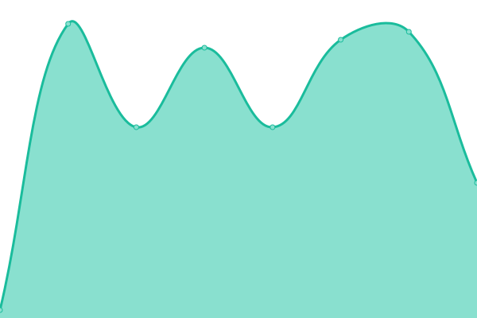

# [📈 Live Status](https://Alecyrus.github.io/Status): <!--live status--> **🟩 All systems operational**

This repository contains the open-source uptime monitor and status page for [THORN](https://thorn.so), powered by [Upptime](https://github.com/upptime/upptime).

With [Upptime](https://upptime.js.org), you can get your own unlimited and free uptime monitor and status page, powered entirely by a GitHub repository. We use [Issues](https://github.com/Alecyrus/Status/issues) as incident reports, [Actions](https://github.com/Alecyrus/Status/actions) as uptime monitors, and [Pages](https://Alecyrus.github.io/Status) for the status page.

<!--start: status pages-->
<!-- This summary is generated by Upptime (https://github.com/upptime/upptime) -->
<!-- Do not edit this manually, your changes will be overwritten -->
<!-- prettier-ignore -->
| URL | Status | History | Response Time | Uptime |
| --- | ------ | ------- | ------------- | ------ |
|  [THORN Auth Service](https://auth.thorn.so) | 🟩 Up | [thorn-auth-service.yml](https://github.com/mooncyan/Status/commits/HEAD/history/thorn-auth-service.yml) | 

 924ms
     
 | 

<a href="https://status.thorn.so/history/thorn-auth-service">80.99%</a>
    

|  [THORN Website](https://www.thorn.so) | 🟩 Up | [thorn-website.yml](https://github.com/mooncyan/Status/commits/HEAD/history/thorn-website.yml) | 

 566ms
     
 | 

<a href="https://status.thorn.so/history/thorn-website">100.00%</a>
    

|  [THORN Website (China)](https://www.thorn.so) | 🟩 Up | [thorn-website-china.yml](https://github.com/mooncyan/Status/commits/HEAD/history/thorn-website-china.yml) | 

 95ms
     
 | 

<a href="https://status.thorn.so/history/thorn-website-china">100.00%</a>
    

|  [THORN Data Sync Service (China)](https://syncpoint.thorn.red/latency) | 🟩 Up | [thorn-data-sync-service-china.yml](https://github.com/mooncyan/Status/commits/HEAD/history/thorn-data-sync-service-china.yml) | 

 981ms
     
 | 

<a href="https://status.thorn.so/history/thorn-data-sync-service-china">81.00%</a>
    

|  [THORN Data Sync Service (Asia)](https://hk.syncpoint.thorn.so/latency) | 🟩 Up | [thorn-data-sync-service-asia.yml](https://github.com/mooncyan/Status/commits/HEAD/history/thorn-data-sync-service-asia.yml) | 

 857ms
     
 | 

<a href="https://status.thorn.so/history/thorn-data-sync-service-asia">81.02%</a>
    

|  [THORN Data Sync Service (North America)](https://sv.syncpoint.thorn.so/latency) | 🟩 Up | [thorn-data-sync-service-north-america.yml](https://github.com/mooncyan/Status/commits/HEAD/history/thorn-data-sync-service-north-america.yml) | 

 286ms
     
 | 

<a href="https://status.thorn.so/history/thorn-data-sync-service-north-america">81.03%</a>
    

<!--end: status pages-->

[**Visit our status website →**](https://Alecyrus.github.io/Status)

## 📄 License

- Powered by: [Upptime](https://github.com/upptime/upptime)
- Code: [MIT](./LICENSE) © [Alecyrus](https://Alecyrus.github.io/Status)
- Data in the `./history` directory: [Open Database License](https://opendatacommons.org/licenses/odbl/1-0/)
